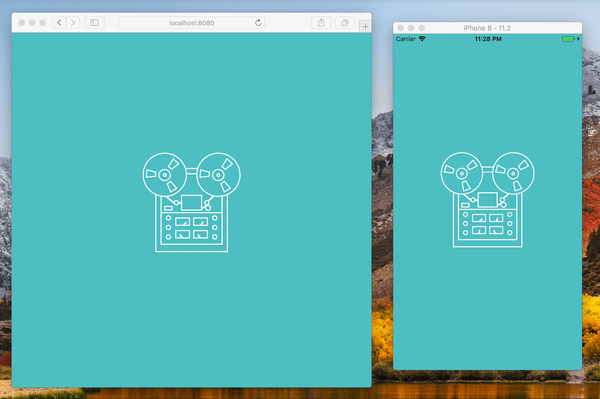

# React Native CSS modules with styleName syntax

-blue.svg>)
[](https://egghead.io/courses/how-to-contribute-to-an-open-source-project-on-github)

This is an example app that shows how you can use the `styleName` syntax in React Native.

**Quick links:** **[Features](#example-app-features)** • **[Try it](#try-it)** • **[Documentation](https://github.com/kristerkari/react-native-css-modules#documentation)**

---



This app takes [Tape Recorder](https://codepen.io/scottohara/pen/qobKB) codepen by [Scott O'Hara](https://codepen.io/scottohara/) and ports it to React Native. You can try to run in both the browser and React Native.

To see code examples, have a look at [TapeRecorder.css](src/TapeRecorder.css) and [TapeRecorder.js](src/TapeRecorder.js#L153) inside src folder.

## Example App features

#### React Native and Web

- :tada: Allows `styleName` and `style` properties to be used on React Native elements such as `<Text>` or `<View>`.
- :fire: CSS Hot loading (live reloading).
- :mag: [Custom stylelint config for React Native CSS modules](https://github.com/kristerkari/stylelint-config-react-native-css-modules)

#### React Native specific

- :package: Uses [React Native CSS modules](https://github.com/kristerkari/react-native-css-modules) with `styleName` syntax.
- :globe_with_meridians: [Platform specific file extensions](https://facebook.github.io/react-native/docs/platform-specific-code.html#platform-specific-extensions), e.g. `styles.ios.css`, `styles.android.css`, `styles.native.css`.

#### Web specific

- :package: Uses [Webpack](https://webpack.js.org/) + [CSS modules](https://github.com/css-modules/css-modules) + [babel-plugin-react-css-modules](https://github.com/gajus/babel-plugin-react-css-modules).
- :wrench: Uses [React Native for Web](https://github.com/necolas/react-native-web) to make most React Native elements work in the browser.

## Try it

### Step 1: Install depencies to run React Native

Make sure that you have `react-native-cli` installed (`npm install -g react-native-cli`) and [XCode](https://developer.apple.com/xcode/) (for iOS development) / [Android Studio](https://developer.android.com/studio/index.html) (for Android development) installed and working.

- Go to "Building Projects with Native Code" tab and follow the guide: https://facebook.github.io/react-native/docs/getting-started.html

### Step 2: Clone the repo and move to project

```sh
git clone git@github.com:kristerkari/react-native-css-modules-stylename-example.git
cd react-native-css-modules-stylename-example
```

### Step 3: Install example app's dependencies

```sh
npm install
```

### Step 4: Run React Native packager

You can open a new terminal tab to run React Native's packager.

```sh
npm start
```

### Step 5: Run app on Android, iOS or Web

First make sure that your Android emulator or iOS simulator is working, then:

```sh
npm run ios
```

or

```sh
npm run android
```

or

```sh
npm run web
```

Web app can be accessed by opening `http://localhost:8080` in a browser.

---

...or if you use Yarn:

```sh
yarn ios
```

```sh
yarn android
```

```sh
yarn web
```
